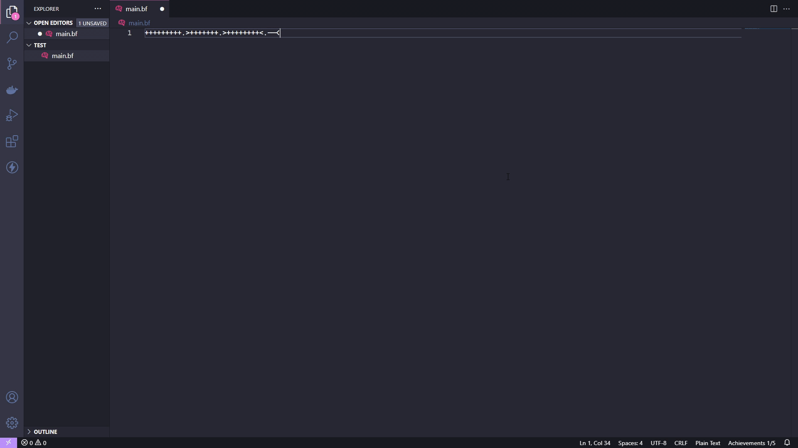

# Achievements

This is a [Visual Studio Code extension](https://code.visualstudio.com/), written in Typescript.  
`Achievements` was made to make coding in Visual Studio Code a bit more enjoyable, but mostly is just for fun.

## Features

So there are two ways you can use this extension:
1. Just coding like you are used to and sometimes get a little notification, that you accomplished an achievement due to some action.

2. Hunt the achievements and try to get them all.
Ensure that you've read through the extensions guidelines and follow the best practices for creating your extension.